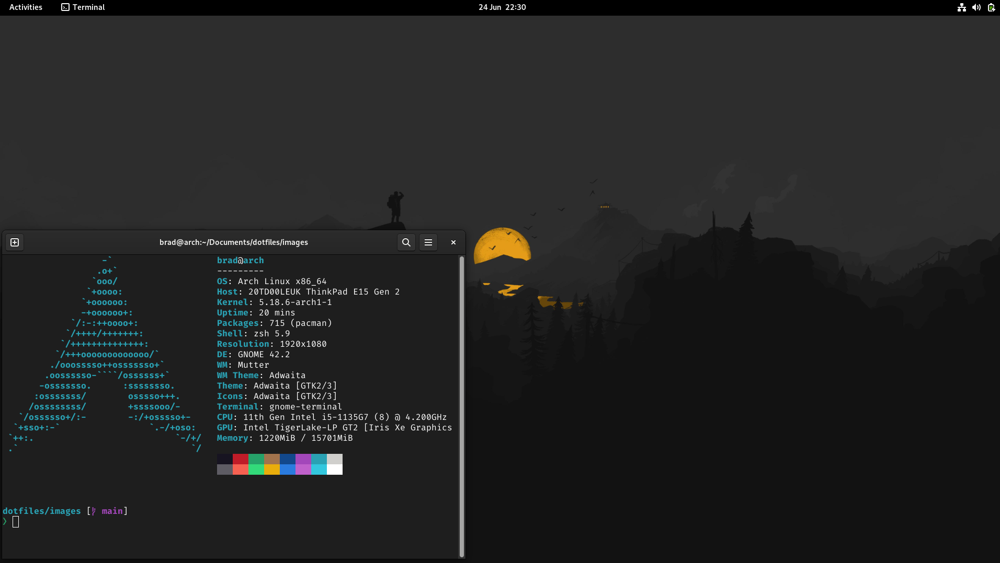

# Dotfiles

A collection of dotfiles for my [Arch Linux](https://archlinux.org/) setup, I
usually use this setup on a Laptop, to make the most of
[GNOME](https://www.gnome.org/) gestures.

**NOTE** This will require root privileges to create the links, and to install
the relevant packages.

## How to use

- Clone the repo `git clone git@github.com:bradb423/dotfiles.git && cd dotfiles`
- Run the setup script `./scripts/setup.sh`
- There is some extra setup:
  - You will need to configure the terminal to use the Nerd Fonts after install
  - The background and theme will have to be set via the settings menu (The background images is `~/Pictures/firewatch.jpg`)
